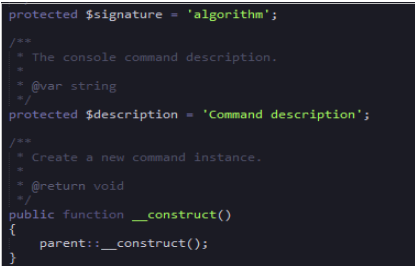
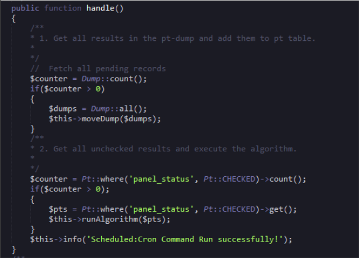
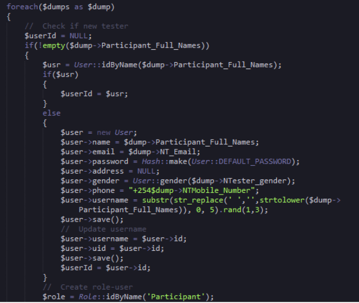
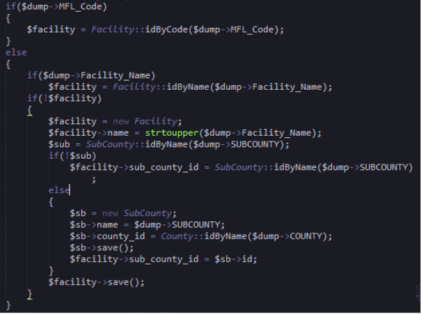
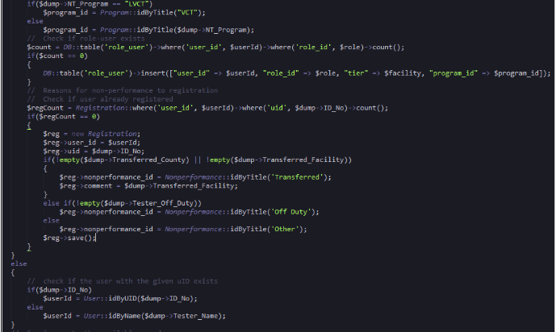
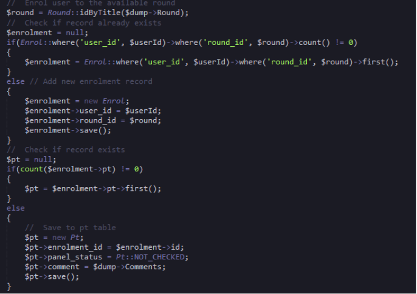
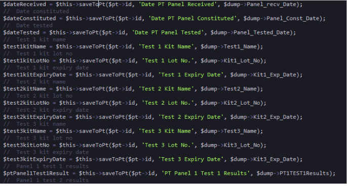
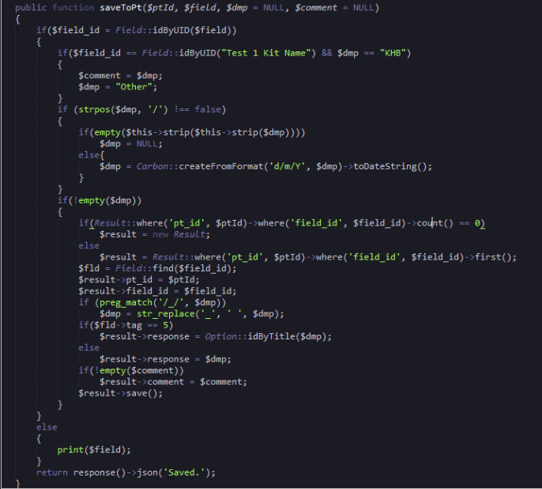
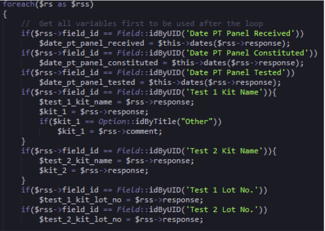
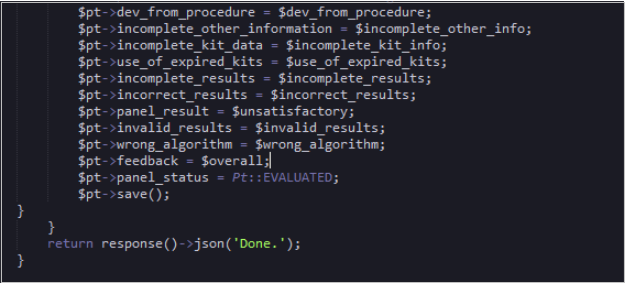

###4.1 Results Check Algorithm

The algorithm is the one responsible for counter checking the results entered by participants. The algorithm file is found in app/console/commands folder. The algorithm is a scheduled cron job which can be configured in the server to run as frequently as possible. The algorithm file includes all the necessary model for it to run.  It has a signature and a description that describe the console command.  A new command is instantiated using the construct function as shown below.

 

##4.2 Algorithm Functions

###4.2.1 Handle Function

The handle function shown below fetches pending records form the dump database table then moves them to the pt table. This process involves calling another function moveDump. Then the data in the pt table is again checked to see if the panel_status column has the value of ‘checked’  which is one (1). Then every row which has that value is assigned to the variable $pts which is then passed to another called function runAlgorithm as a parameter for the background processing of the results to start.

  

####4.2.2 MoveDump Function

This is the function which is called by the handle function to move data from the dump table to the pt table. The function uses the $dump parameter as the data retrieved from the dump table. Then a foreach loop is uses to loop through the rows. The if statement retrieves the participant full name column data so long as it is not empty. The participant name is used to find their id in the user’s table that is if they exist. If the user is not in the user table, a new user is created with role of a participant. This is shown below;

  

The mfl code is then used to find the id of the facility otherwise the facility name is used to retrieve the facility code. The sub county id is also fetched and assigned to the sub_county_id column in the facility table. If the facility name is not found a new sub county instance is created and the name, county_id are data are added to the instance and saved. Once the saved the sub county id is retrieved from the instance and assigned to the facility sub_county_id  column then saved. The code is shown below;

  

The algorithm continues to get the program is based on the Title which is vct and assigned it to the variable $program_id.  Then a query is run to find if a user is registered in the registration table and if not, a new registration instance is created.  Otherwise a check of the user is done to check if the  given user id exist.

  

Then the user is enrolled to the available round where a check is done to see if the user has been already enrolled to a round otherwise a new *Enrol* instance is created and saved.

  

The new pt instance shown above is then uses to save all the data from the dump  database able via the saveToPt function. Part of saving process is shown below;

 

###4.3 SaveToPt Function

This function saves the data from the dump table to the pt table. The function accepts parameters for its functionalities to run.   First the field id is retrieved and if it has not been found, the field id is retrieved by the name and assigned to the $field_id variable.  Then a result query is run to check if the record exist in the results table and if not a new result instance is created. Otherwise the results object is used to save data to the pt_id and filed_id columns. Finally the data is saved. The logic is shown below;

  

###4.4 Strip (), is_a_date(), dates () Functions

The strip function is responsible for removing the specified beginning of a text to get the Id alone, while the is_a_date function return the date format and finally the dates function is also responsible for the data format.

###4.5 Check Functions

This functions check whether the given parameters were correspond to the expected results once the results and test kits results are submitted by the user.
    • Check_dates (): This function checks when the testing panel kits were received by the participant. It also checks when the test panels were constituted and when they were used for testing.
    • Check_kit_info (): This functions checks that all the kit data provided is complete.
    • Check_expiry (): This function ensures that the kit used for testing was not expired.
    • Check_complete_results (): This functions ensures that all data to be captured by the results form was entered.
    • Check_correct_results (): This function checks the correctness of the results submitted.
    • Check_satisfaction (): This function uses the results from the check_corret_results  to determine whether the results is unsatisfactory.
    • Check_validity (): This function checks if the results submitted are valid.
    • Check_algorithm (): This function checks if the algorithm was followed during results entry.
    • Check_overall (): This function sets the overall result either satisfactory or unsatisfactory.

###4.6 Run Algorithm Function

This is the function which process the results once they have been submitted by a user. The function uses the data from the pt table as the parameter. Then a foreach loop is used to loop through the rows using the $pts variable returned from the handle function. Expected results for the round are fetched by retrieving the round id and the user. The user details are retrieved through the user’s registration id.

 Then the lot panels are also retrieved and assigned to the $res variable.  The results from the $pt variables are then assigned to the $rs variable which is used to get all variables to be used after the loop. The different test kit variables columns are then filled identified by the id as shown below;

   

After the kits and panels are checked the expected results are then fetched using the check function discussed above. After the results are checked agonists the expected results the pt table is updated with the below code and saved.

   

Then a json response is returned indicating the algorithm has finished running.

