###3.1 Backend Code Design

To explain the system code design will use the participant CRUD together with the search functionality to explain the general PHP, Vuejs and Html design structures.

###3.2 Participant Controller
The participant controller is located as shown below;

   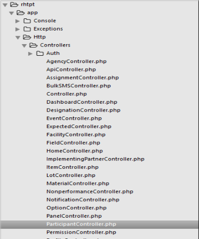

The controller imports the relevant classes which are required by the available functions within the controller using the use statement. Some of the classes which are used within the controller are shown below;

  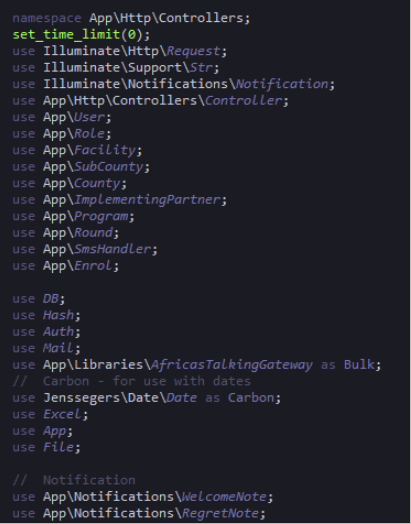

###3.3 Functions

The participant controller has different functions within it the functions are explained below;

###3.3.1 Public function manageParticipant()

This function returns the participant index.blade view file which displays it in the front end.

###3.3.2 Public function index (Request $request)

This function is responsible for filtering are fetching data depending also on the different roles from the various tables and pass the data though the participant java script file for them to be displayed in the front end. It uses the request parameter to fetch the necessary data. Some of the methods used in this function is the user statistics which is used to calculate the number of active and inactive participants. The code is shown below.

   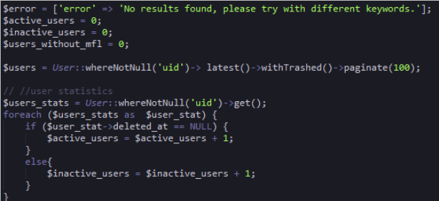

Firstly the users where the user id (uid) is not null are retrieved and assigned to the variable $user_stats. Then a foreach loop is used to get each individual user using the variable $user_stat. An if statement is then used to if the column deleted_at is equal to null  then the variable  $active_users which was initialized to zero is assigned the sum total of each user where the column deleted_at is equal to null. Otherwise were the column deleted_at is not equal to null the sum of each of those users is assigned to the variable $inactive_users.

###3.3.3 Filter based on User Roles

The function contains methods that retrieve data depending on the role of the user who has logged into the system. The different roles include county coordinator, sub county coordinator, partner, and facility in charge. The code for this is explained below;

The diagram below shows the code for two different roles that is the county coordinator and the sub county coordinator. The parameters of the if statement make use of the auth service provided by laravel to differentiate the different users who have logged into the system. The is Auth::user()->isCountyCoordinator() functions checks if the role of the user is the county coordinator. This function is retrieved the user model. If the role is found to be county coordinator then users and facilities are retrieved based on the county location of that coordinator and assigned to the $users variable by this query statement.

$users=County::find(Auth::user()->ru()->tier)->users()->latest()->withTrashed()->paginate(100);

   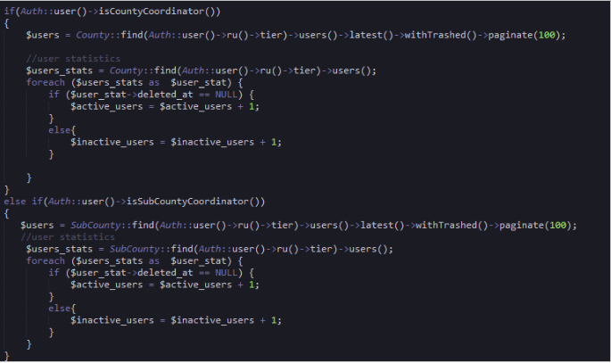

The query uses the County model where the user is filtered then the role of the user is gotten by using role user(ru) then facilities which the user is in charge of is  retrieved  using tier and then finally all users who match that criteria are retrieved with a pagination of 100. This means for each page there will be a hundred results per page. Then the code for calculating statistic is applied.

###3.3.5 Filter users by details
The users filter also uses the $request parameter to sort participants based on the role of the users. If the role is a county coordinator the results will be filtered based on that criteria otherwise if it’s the administrator role then it will filter based on the different conditions. The code is shown below;

   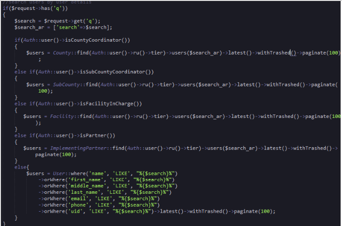

The code the $request service to get the users details donated by ‘q’ which is retrieved from the web route API  get request shown below.

   Route::get('api/search_participant',['as'=>'participant.search', 'uses'=>'ParticipantController@index']);

The request is as a result of the call made by the participant javascript file search functions shown below;

   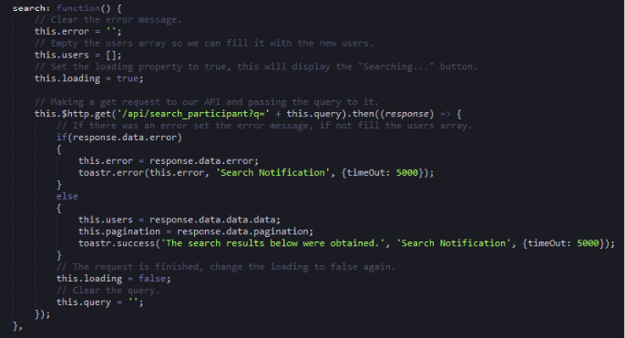

This code is found in the  public controllers folder participant.js file. The request which is used in the participant controller $request->get(‘q’)  is found in the functions http get request. Once the controller retrieves the data it is passed to the  JavaScript file using the response function and returned as json data. The javasript search function uses the users array as the variable which stores the response user’s data and then it can be accessed in the front end.
###3.3.6 Store Function

This function creates new users and stores them in the database. The code shown below;

  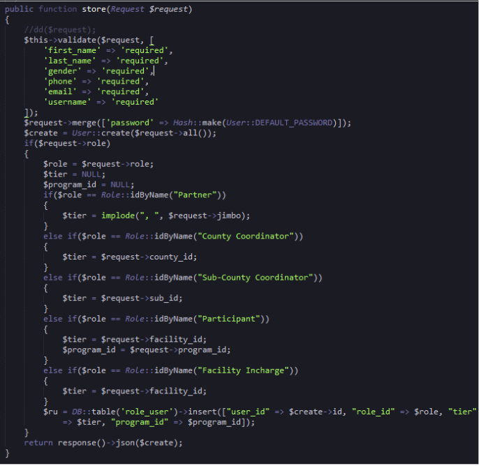
The code uses the validate function to verify the required fields. The password is then hashed for security reasons and stored. The role of the user when creating a user is stored in the $role variable then the $tier variable is initialized to null. This will be used to store the facility of the user. The facility id of the user will be then inserted into the user role table.

###3.3.7 Destroy function
This function disables the use account. Once the button is clicked the user receives a message that their account has been disabled. The code is shown and explained below;

  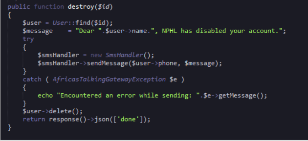

The message the user will receive is assigned to the $message variable together with their name which is a result of a query where the user is retrieved based on their ‘id’.   The code uses the smshandler to send messages.  The logic is wrapped up in a try_catch method which displays the error massage incase an error is encountered.

###3.3.8 Restore Function
The restore function shown below is designed to restore a disabled user. The function uses the ‘id’  of the user and the restore function to reactive the user. Then the id  of the user is used to find the details of the user where the name of the user is concatenate with the message and assigned to the $message variable. The message is sent to the user using the smshandler  servce with the user’s phone and message variables as the parameters.

  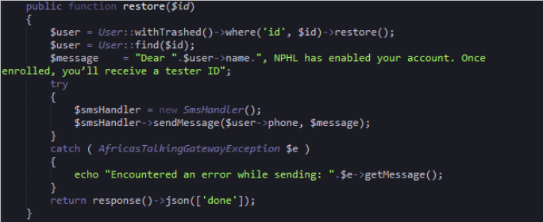

###3.3.9 Transfer facility function

This function is responsible for transferring participant from one facility to another. The function uses the request service and the $id variable to search for the particular user. The code finds the facility the user is transferring to and the result is assigned to the ‘$fac’ variable. Then $fac variable is assigned to the tier column. The program_id is then assigned to the $prog variable which is then assigned to the program_id column. Finally the content is saved and result returned as a json response. The code is shown below;

   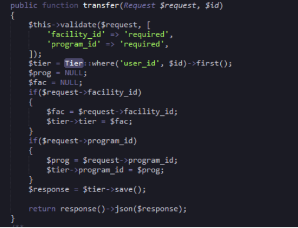

###3.3.9.1 Enrolled function
The enrolled function is used to get enrolled participants.. The code logic is shown and described below;

   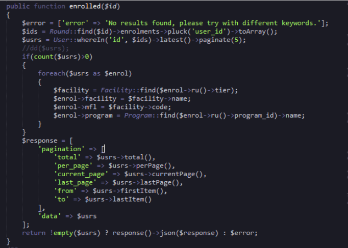

The code starts off with the declaration of the error massage which is assigned to the error variable. The function uses the id parameter to get the identification of each individual participant. The id is used with the round table to get the user id’s of the enrolled participants and convert them to an array using the toArray() function. Then the users details are retrieved and assigned to the variable $usrs.

The code uses the if statement to check if the $usrs variable has more than zero rows then a foreach loop is applied to get each individual column. A facility query is initiated to get the facility which he is in then the individual object column is assigned to the specific object column of the foreach $enrol variable. The response variable is returned to the JavaScript file as an array of data.

###3.4 Participant JavaScript file

The Participant JavaScript file starts with including the CSRF token  in the header and then a new Vue instance is created. The name of the initialized Vue object is manage-participant and is maintained in the ‘el’   vue property. The variable which are used within the file are initialized and declared in the ‘data’ Vue property. The Vue ‘computed’  property is responsible maintaining  computational functions while the ‘mounted’ property is for declaring functions which need to be  preloaded. The ‘method’ property is responsible for all functions within the JavaScript file.

###3.4.1 GeVueUsers function

This Vue participant  JavaScript function is responsible for retrieving data via the API using the get request and handles the data from the json response gotten from the controller. The response json object is used to assign the different variables with the required values then an if statement is used as a condition of checking the different roles so as to retrieved the various counties, sub counties and facilities through the API. The code is shown below;

   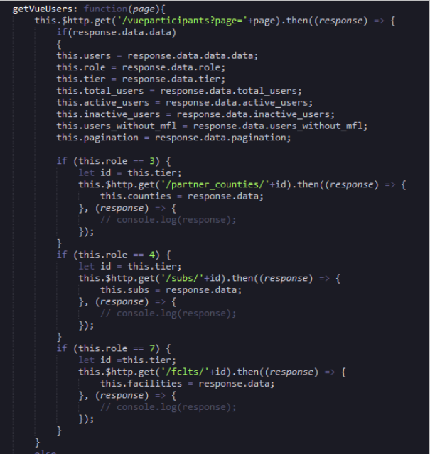

###3.4.2 Create User Function
This function registers a new user into the system. The function uses the validate function and the scope parameter to counter check the data entered in the fields. The function uses the post request to post data to the API for storage. The data is sent from the front end through binding of data from the this.newUser object. Then on successful data registration of a user a success massage notification popup with a timeout of 5000. Otherwise if there is an error during this process and error massage within the code will be displayed. The code is shown below;

  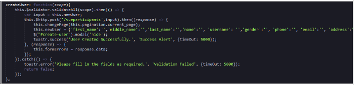

###3.4.3 Delete/disable User Function

This function disables a user by making a call to the controller destroy function via the API.  The function uses the user object parameter to get the specific user id so as to disable that user. Once disabled a success message will popup. The code is shown below;

  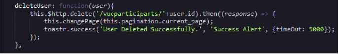

###3.4.4 Restore User Function

This function uses the patch request in the API to restore a disabled user. The function also uses the ‘user’ parameter object to get the users id  and on displays a message on success. The code is shown below;

   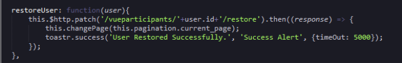

###3.4.5 Update User Function
This function updates a particular participant’s data using the put API request. The function captures data through binding i.e filluser.first_name is used in the #edit-user modal to get the first name of a user. On save a success message pops up otherwise an error message is shown. The code is shown below;

 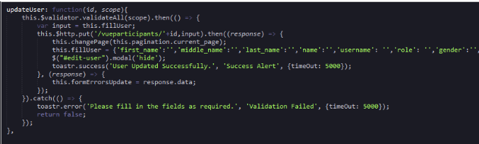

###3.4.6 Other Participant JavaScript Function
The file has a number of function which retrieve data such as the loadfacilities, loadprogram, loadroles.. loadsubcounties, and loadsexes. Other functions include the denyUser function which is used by an authorized user to reject a participant request for registration. The code is shown below;

  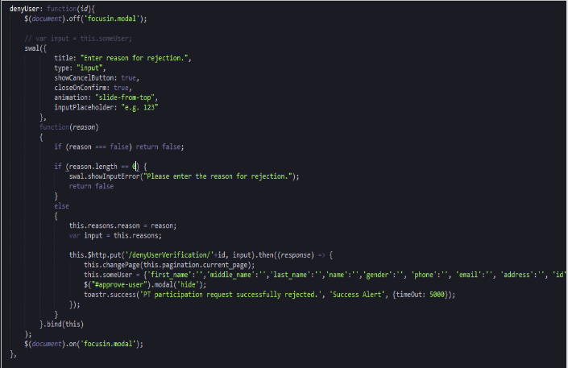

###3.4.7 Participant index file

The participant file is responsible for data capture and manipulation. The data is presented to the index  file by the JavaScript file  enclosed in the ‘el:manage-participant’ property all data must be wrapped in a div  as shown;

  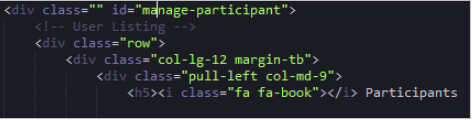

###3.5 Link between Controllers, JavaScript, API and Index files

When creating a new CRUD instance one will need a controller, js and index file. The controllers will be made using the php artisan make caravel make command. The javascript file will be in the appropriate folder as discussed above while the index file will be made in the resources folder.  To link the three files to ensure that the functions are working correctly. Create a route in the API web route file as the one shown below;

  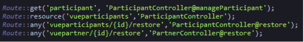

The javascript file in this case the participant javascript file API CRUD request will use the controllers CRUD as a resource. Then the javascript file if called in the browser during loading so as to carry out the various functionalities. To do this the below line is added at the bottom of the app.blade file.

   

The below image shows the code in the context explained above together with other JavaScript files.

   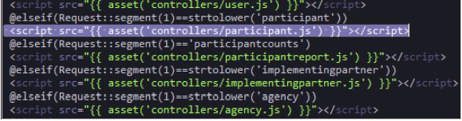

