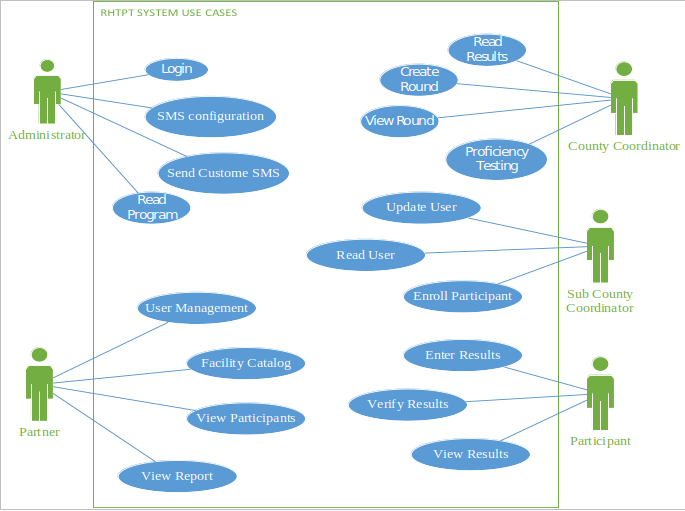
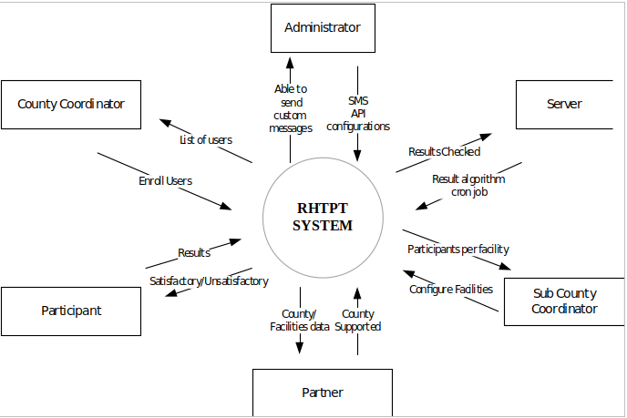
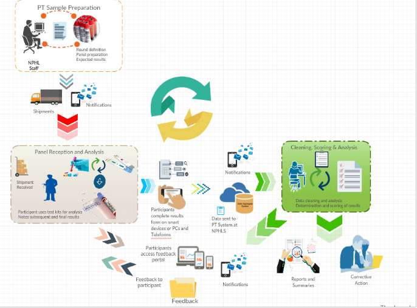
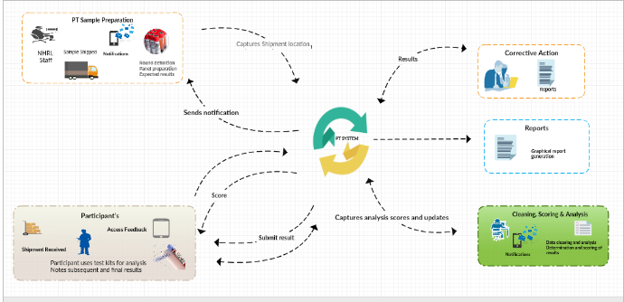

The following diagrams illustrate the overall system design of how the system was build and how different entities work within the system.
    
  
    

The use case diagram shows some of the functions carried out by the different roles within the system. The use case is a general overview of the RHTPT system and the main users who interact with the system. One of the main users is the participants whose some of the functions are shown by the participant use case.

   

The data flow diagram shows how different input data generates different out data for different users within the system. Data form the system is not unique to a specific user as it depends on the permission the users have.

   

The above context diagram show the different entities that interact with the RHTPT system.

###2.8.1 Hosting Requirements 

###2.8.2 Server Software 

The CDM is built on Microsoft .NET Framework version 2.0 with a database backend stored in Microsoft SQL Server. 

    • Microsoft Windows 2012 or 2014 Server operating system 
    • Microsoft Internet Information Server 5 or Microsoft Internet Information Server 6 Note: these components are included with Microsoft server operating systems but must be installed and configured separately. 

    • Microsoft SQL Server 2012 

###2.9 Server Hardware 

###2.9.1 Web Server 
   
    • Intel Pentium 3 or Intel Pentium 4 operating at 2 GHz or better, or AMD Athlon XP or AMD Athlon 64 operating at 1.8 GHz or better 
    • 512 MB RAM or better 
    • Website files are approximately 85 MB. There are items that can make this grow. For example, users are able to upload participant documents to the system. Those files exist on the server with references to them in the database. 

###2.9.2 Database Server 
   
    • Intel Pentium 3 or Intel Pentium 4 operating at 2 GHz or better, or AMD Athlon XP or AMD Athlon 64 operating at 1.8 GHz or better 
    • 512 MB RAM or better (1 GB recommended) 
    • 40 GB hard drive – This is a high estimate for space required. Actual space needed depends on number of participants, users, and files uploaded into the documents, forms, and participant files. As a rough estimate, a program of 1,000 participants would result in a database of approximately 200 MB in two years. 

###2.9.3 Africastalking

This is a web based SMS integration API that helps in the sending of SMS notifications. The API can be used in various platforms such a php. The integration of the API into the system was easy as it only requires one file and the API username and key which can be gotten from the website if Africa’s Talking. The API helped in the development of the SMS module which is responsible for bulk SMS notification to users. For more information on the API click on the following link http://docs.africastalking.com/sms/sending

The AfricasTalking gateway php file is located    \rhtpt\app\Libraries in the project folders and can be accessed using “use App\Libraries\AfricasTalkingGateway” in the controller.

   

   
